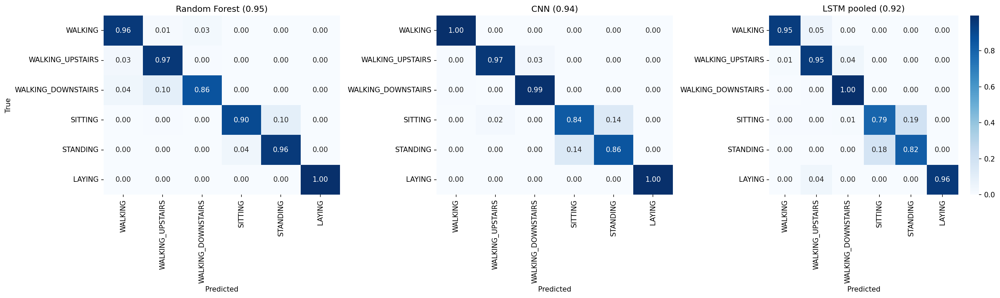
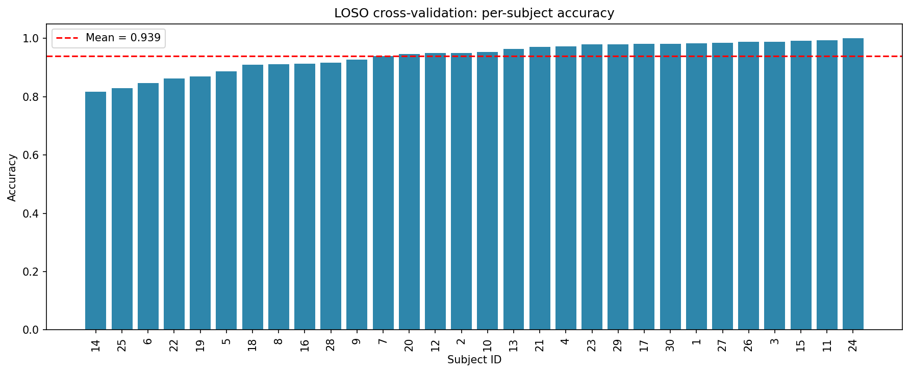

# Human Activity Recognition: Signal Processing vs. Deep Learning

Classifies six human activities (walking, walking upstairs, walking downstairs, sitting, standing, laying) from raw smartphone accelerometer and gyroscope signals. The project compares hand engineered signal processing features against raw deep learning, and checks how well the model generalizes to subjects it has never seen.

**Live components:** FastAPI prediction endpoint and Streamlit dashboard, both built on the best performing model.

---

## Why this project

Most HAR portfolio projects load the UCI HAR dataset's pre computed 561 features and train a classifier on top of them. This project skips that shortcut on purpose. The features are built from raw inertial signals, so the signal processing reasoning is the actual work being shown here, not just the modeling on top of someone else's features.

---

## Dataset

[UCI HAR Dataset](https://archive.ics.uci.edu/dataset/240/human+activity+recognition+using+smartphones). 30 subjects, 6 activities, captured with a waist mounted smartphone accelerometer and gyroscope at 50Hz, pre segmented into 2.56 second windows (128 samples) with 50% overlap.

Raw signal channels used: `body_acc_{x,y,z}`, `body_gyro_{x,y,z}`, `total_acc_{x,y,z}` (gravity inclusive).

---

## Methodology

### 1. Feature engineering from raw signals

**Time domain:** mean, std, RMS, min, max, and a mean centered zero crossing rate. Centering matters because a raw window can carry a DC offset, and that quietly undercounts real oscillations if it isn't removed first.

**Frequency domain:** Welch power spectral density with `nperseg=len(window)`, since each window is already a fixed length, non overlapping segment. From this: dominant frequency, spectral energy, and spectral entropy.

### 2. Diagnosing and fixing a specific failure

A first pass model using only motion based features (time and frequency domain on `body_acc`/`body_gyro`) reached 89% accuracy, but sitting and standing were weak (F1 0.81 and 0.86). The two were confused with each other 17% of the time.

The hypothesis was that sitting and standing don't really differ in motion, they differ in device orientation, and none of the motion based features could capture that.

The fix was to add gravity and orientation features (mean and std of `total_acc` per axis) along with axis correlation features.

That pushed accuracy to 95%, sitting F1 to 0.93, standing F1 to 0.94. Feature importance backed up the reasoning directly. `grav_mean_x` and `grav_mean_y` came out as the two most important features out of 63.

| | v1 (motion only) | v2 (+ gravity/orientation) |
|---|---|---|
| Accuracy | 0.89 | **0.95** |
| Sitting F1 | 0.81 | **0.93** |
| Standing F1 | 0.86 | **0.94** |
| Laying F1 | 0.90 | **1.00** |

One honest side effect worth mentioning: walking_downstairs confusion shifted slightly, getting a little worse against walking_upstairs. Gravity features fixed orientation ambiguity, but they can't tell you which direction someone is moving on stairs.

### 3. Deep learning comparison

A 1D CNN and a bidirectional LSTM were trained directly on the raw 9 channel signals, no hand engineered features at all, to see whether learned features could match or beat the engineered ones.

| Model | Accuracy | Sitting F1 | Standing F1 |
|---|---|---|---|
| **Random Forest (engineered features)** | **0.95** | **0.93** | **0.94** |
| CNN (raw signals) | 0.94 | 0.85 | 0.87 |
| LSTM, mean pooled (raw signals) | 0.92 | 0.81 | 0.85 |

The classical model with engineered features beat both deep architectures, and it beat them consistently on the same class pair (sitting and standing). A likely explanation is that the CNN's BatchNorm layers normalize out the mean signal per channel, which is exactly the orientation cue the gravity features rely on directly. The CNN and LSTM instead did better on motion heavy classes like the walking family, where detecting a local temporal pattern is a natural strength.



(One implementation note on the LSTM: an earlier version pooled from only the last timestep, which threw away most of the backward direction signal in a bidirectional model. Switching to mean pooling across all timesteps recovered about 2 points of accuracy. Small reminder that readout design matters almost as much as the architecture itself.)

### 4. Generalization: Leave One Subject Out cross validation

A single train/test split reached 95% accuracy, but that's really just one fixed pairing of subjects, not real evidence of how the model would do on a brand new person. LOSO retrains the model 30 times, holding out one subject each time, to measure that directly.

Result: 93.9% ± 5.3% accuracy across 30 subjects (macro F1: 93.4% ± 6.1%).

The single split number wasn't wrong exactly, but it was a bit optimistic. LOSO shows real subject to subject variance, from 81.7% on the worst subject up to 100% on the best.



Looking at individual subjects showed something more interesting than expected: the model doesn't have one weakness, it has a few, and different people trigger different ones.

- **Subject 14 (82%):** walking gets misclassified as walking_upstairs 85% of the time. Probably an unusually vigorous natural gait.
- **Subject 25 (83%):** the familiar sitting/standing split shows up again, 45% confusion. Orientation ambiguity still holds for this person.
- **Subject 6 (85%):** walking_upstairs confused with walking_downstairs 67% of the time. This is the stair direction limitation predicted earlier, since gravity alone can't tell you which way someone is moving on stairs.

This suggests one global feature set can't fully capture how differently people move. A real production system would probably need some kind of per user calibration, or features normalized by stride, to close this gap.

---

## Deployment

**FastAPI (`app.py`)** serves the trained Random Forest through `POST /predict`. It takes a 9 channel, 128 sample raw sensor window and returns the predicted activity, a confidence score, and the full probability distribution across classes. Input is validated with Pydantic so the window length is enforced exactly, and the feature column order is explicitly locked at inference time to avoid a common and very quiet bug in deployed sklearn models where columns silently misalign. There's also a `/health` endpoint for a basic check that the service and model are actually up.

**Streamlit (`streamlit_app.py`)** is a dashboard that consumes this same API rather than loading a separate copy of the model. A user uploads a sensor window and sees the prediction with a confidence bar chart, plus the model comparison table for context.

### Running locally

```bash
python -m venv venv
source venv/bin/activate      # Windows: venv\Scripts\activate
pip install -r requirements.txt

# Terminal 1
uvicorn app:app --reload

# Terminal 2
streamlit run streamlit_app.py
```

---

## Tech stack

Python, scikit-learn, PyTorch, SciPy (signal processing), pandas/NumPy, FastAPI, Streamlit, Plotly, seaborn/matplotlib.

---

## What I'd explore next

- Wavelet based features (discrete wavelet transform or wavelet packet energy) to capture the non stationary structure of human motion better than a single windowed Welch PSD can.
- Stride based or per user normalization, to deal with the subject specific failure modes LOSO turned up.
- Statistical significance testing across the model comparison, since right now it's based on single run point estimates.

---

## Repository structure

```
├── app.py                  # FastAPI prediction service
├── streamlit_app.py        # Dashboard UI
├── requirements.txt
├── model/
│   ├── har_rf_model.pkl        # Trained Random Forest (v2, with gravity features)
│   └── feature_columns.pkl     # Exact feature order used at training time
├── assets/
│   ├── model_comparison_confusion_matrices.png
│   └── loso_per_subject_accuracy.png
└── notebook.ipynb          # Full analysis: feature engineering, model comparison, LOSO
```
